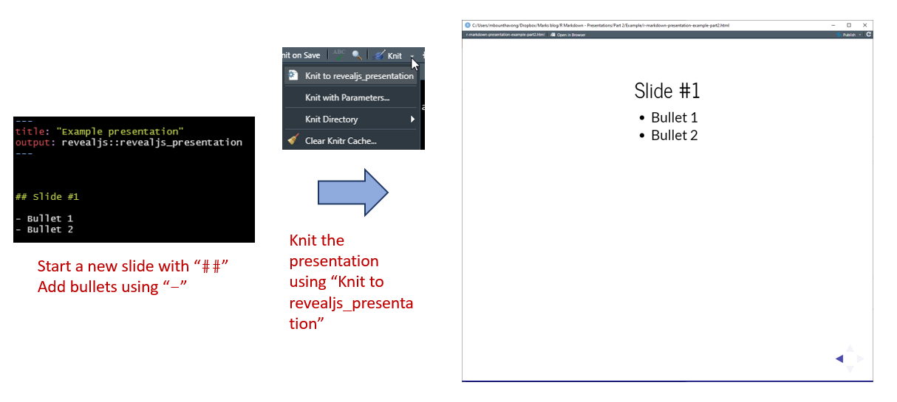
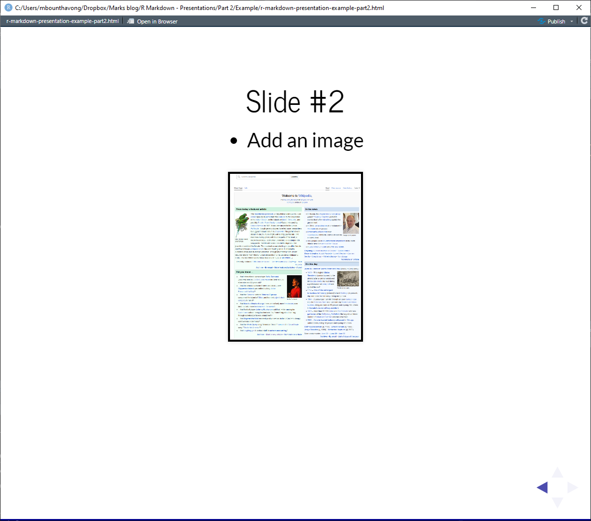
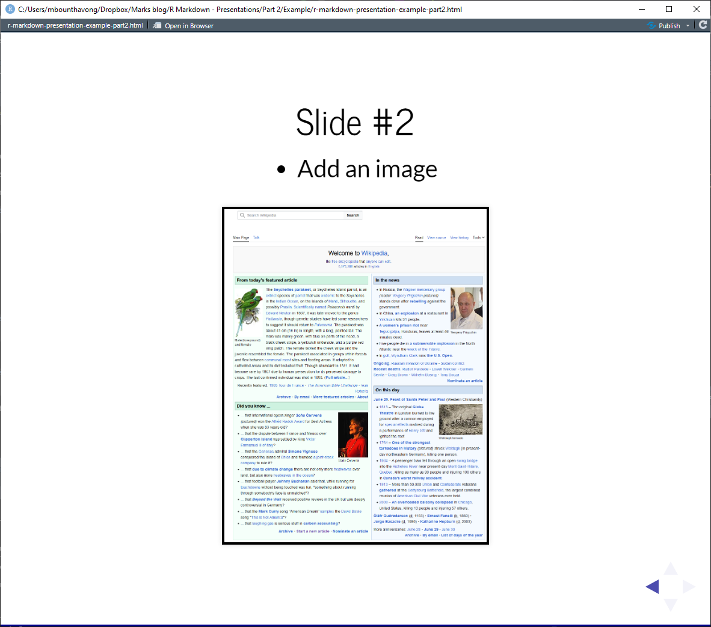
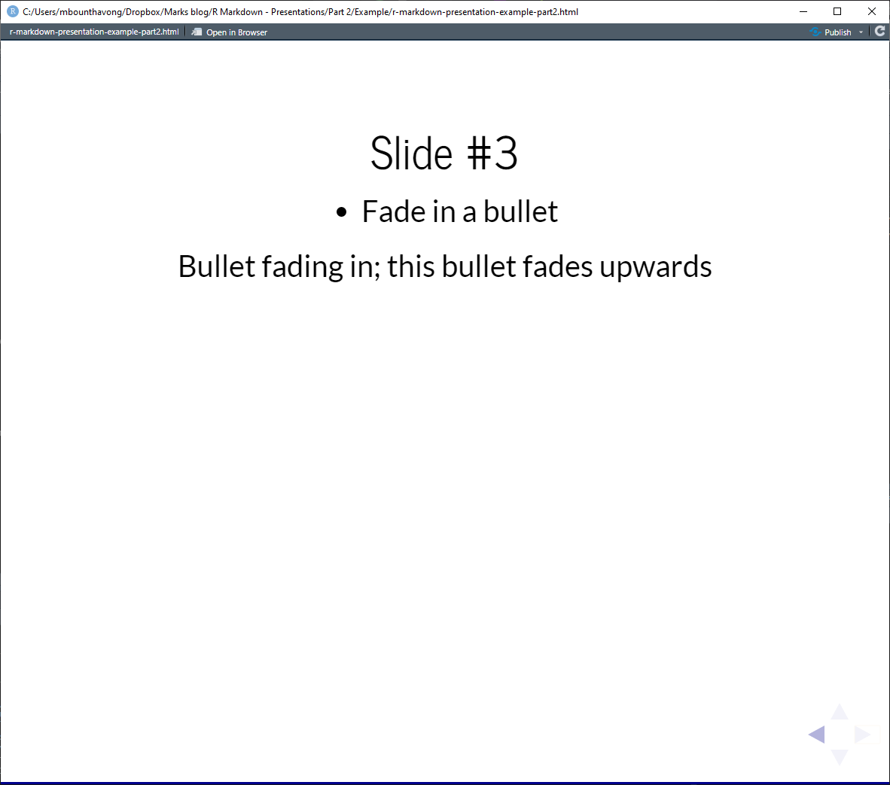

```{r setup, include=FALSE}
knitr::opts_chunk$set(echo = TRUE)
```

## Introduction
In my last [article](https://rpubs.com/mbounthavong/presentation_r_markdown_part_1), I discussed how to start building a presentation using R Markdown. I used my recent presentation at UC Irvine as a template. 
[Here is my HTML presentation](https://mbounthavong.github.io/bio_presentation/#/) that I constructed using `revealjs`. You can also view my presentation below:

```{r, echo = FALSE, warning = FALSE, message = FALSE, out.extra="data-external=1"}
knitr::include_url("https://mbounthavong.github.io/bio_presentation/#/")
```

In this article, I review how to add a new slide to the presentation. I also include some code chunks on how to include an image and use the `fragment` options to have bullets fade-in in th presentation. 

## Objectives
* Add a new slide
* Add an image to a slide
* Add bullets that fade-in


## Create a new slide 
In `revealjs`, you can create a new slide by typing `##`. This denotes when R Markdown should start a new slide. 

Within each slide, you can add bullets using `-`. 

Once you've completed your slide, you can knit it using `revealjs_presentation` from the knit tab. 

```{r, echo= FALSE, warning = FALSE, message = FALSE, out.width = "100%", fig.cap = "Slide #1 creation."}

```


## Adding a figure or image to the slide
You can add a figure or an image to the slide.

You need to include the following syntax: `/<figure name>"`. Make sure that the file path is correct. Most errors occur because the file path is incorrectly listed in the code chunk.

Here is a code chunk of an example where I include an image called `Figure 2.png` with a height of `500`. (Note: I saved this in the folder with my `rmd` file. You may have this located elsewhere; just make sure that the file path is correct.)

```{r, eval = FALSE, echo = TRUE}
## Slide #2

- Add an image


```

The slide looks like the following:

```{r, echo= FALSE, warning = FALSE, message = FALSE, out.width = "100%", fig.cap = "Image has a height of 300."}

```

You can adjust the height of the figure from `300` to `500`. This will proportionally increase the figure size to match the slide size. 

```{r, eval = FALSE, echo = TRUE}

```

```{r, echo= FALSE, warning = FALSE, message = FALSE, out.width = "100%", fig.cap = "Change the image height to 500."}

```


## Adding a bullet that fades in
You can add a bullet and have it fade in. Let's work on making our next bullet fade upwards. 

You can do this with the following syntax: `<p class="fragment fade-up"> Bullet fading in; this bullet fades upwards</p>`

```{r, eval = FALSE, echo = TRUE}
## Slide #3

- Fade in a bullet

<p class="fragment fade-up"> Bullet fading in; this bullet fades upwards</p>
```


```{r, echo= FALSE, warning = FALSE, message = FALSE, out.width = "100%", fig.cap = "Adding a bullet that fades upward."}

```


The fragment options allow you to change the direction of the fade from `fade-up` to `fade-down` or `fade-out`. A list of possible fade options can be located in the [`revaljs` website](https://revealjs.com/fragments/).


## Conclusion
This is a short article on how to create a new slide, add an image, and add bullets that fade into the presentation. I plan on expanding these articles in the future. 


## Acknowledgement

I learned how to start building HTML presentations using the following resources:

* [`revealjs` website](https://revealjs.com/)
* [Tim Mastny's website](https://timmastny.com/blog/embed-slides-knitr-blogdown/) to help embed a presentation into an R Markdown file. 

## Work in progress

This is a work in progress, and I'll likely make updates as I learn more. I created this tutorial to help my future self remember how to construct an HTML presentation. 
